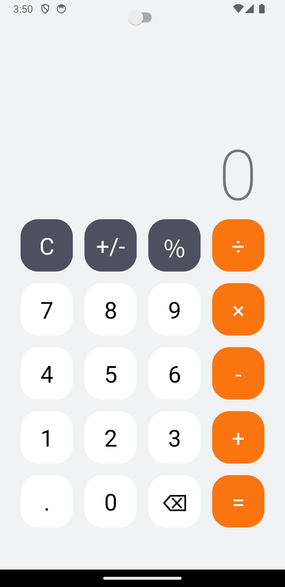

# **React Native Calculator**



## **Description**
This project is a simple calculator built using React Native and TypeScript. It leverages the functional programming paradigm and styled components for UI design. The application is developed using Expo, making it easy to run and test on multiple platforms.

## **Features**
- Basic arithmetic operations (addition, subtraction, multiplication, division)
- Clean and responsive UI
- Cross-platform compatibility (iOS and Android)
- Dark mode

## **Technology Stack**
- **Framework**: React Native
- **Programming Language**: TypeScript
- **UI Styling**: Styled Components
- **Development Environment**: Expo

## **Prerequisites**
Before you begin, ensure you have the following installed:
- Node.js (LTS version recommended)
- npm or Yarn (for managing packages)
- Expo CLI (`npm install -g expo-cli`)

## **Installation**
1. Clone the repository:
   ```bash
   git clone https://github.com/derflex-primo/react-native-calculator.git
   ```
2. Navigate to the project directory:
   ```bash
   cd react-native-calculator
   ```
3. Install dependencies:
   ```bash
   npm install
   ```
   or if you use Yarn:
   ```bash
   yarn install
   ```

## **Running the Application**
To run the application on your local machine, execute:
```bash
expo start
```
This will start the Expo developer tools in your browser. You can then choose to run the application on an iOS simulator, Android emulator, or your physical device through the Expo app.

## **Contributing**
Contributions are welcome! If you'd like to contribute, please fork the repository and use a feature branch. Pull requests are warmly welcome.

## **License**
Distributed under the MIT License. See `LICENSE` for more information.
